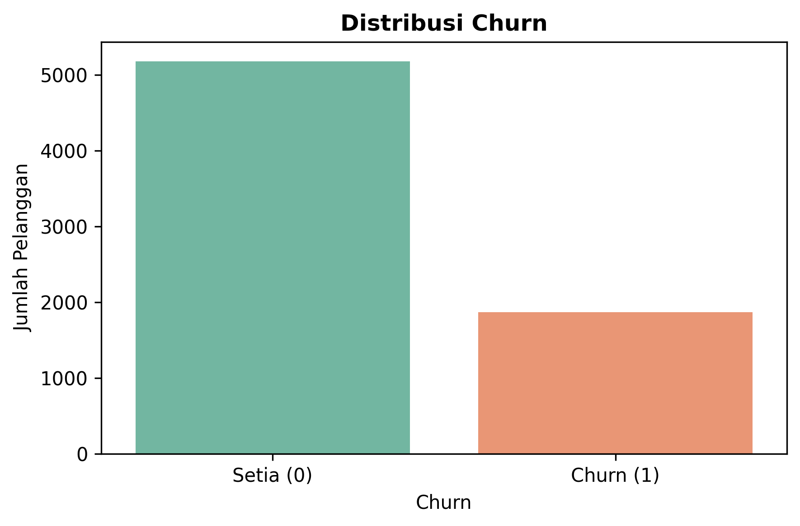
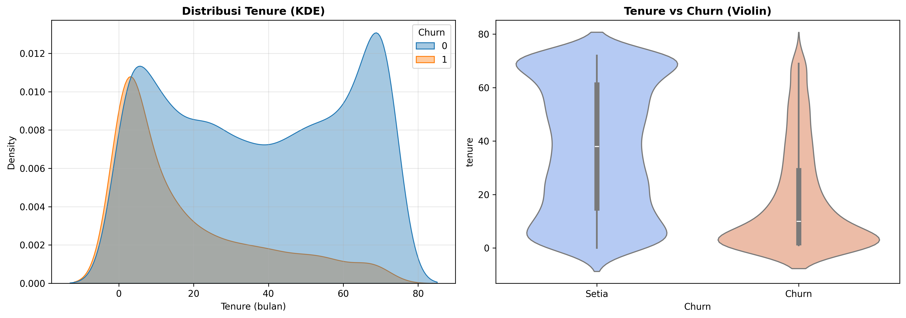
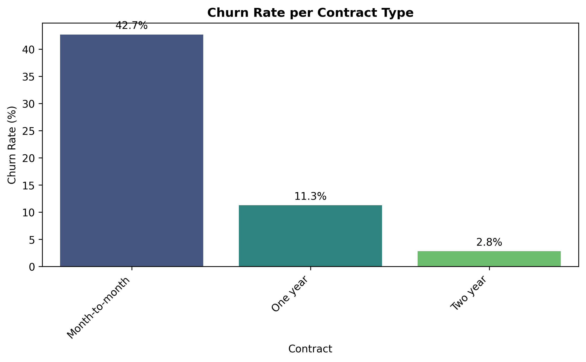
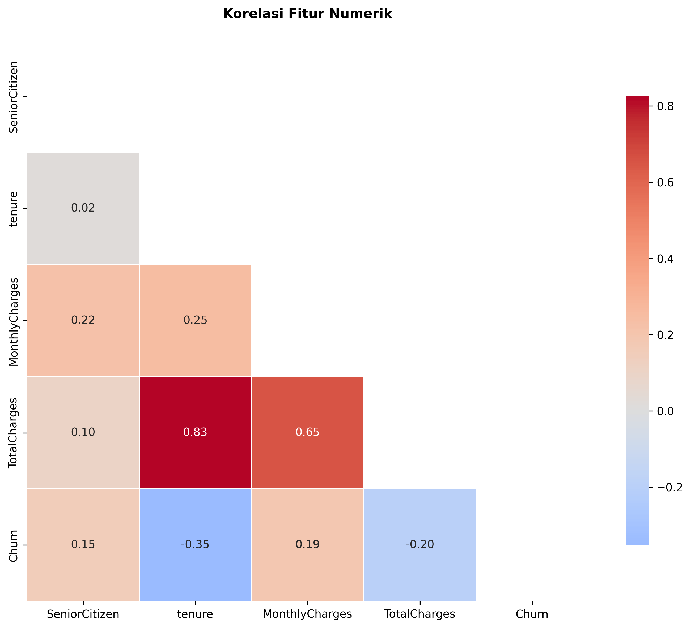
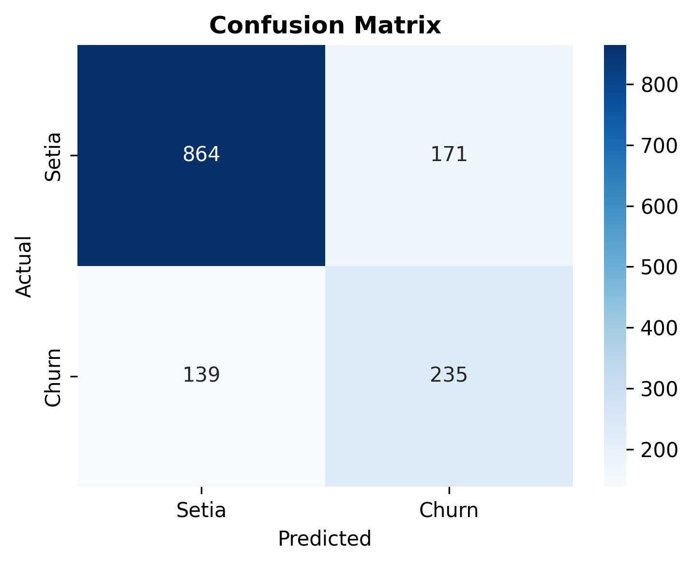
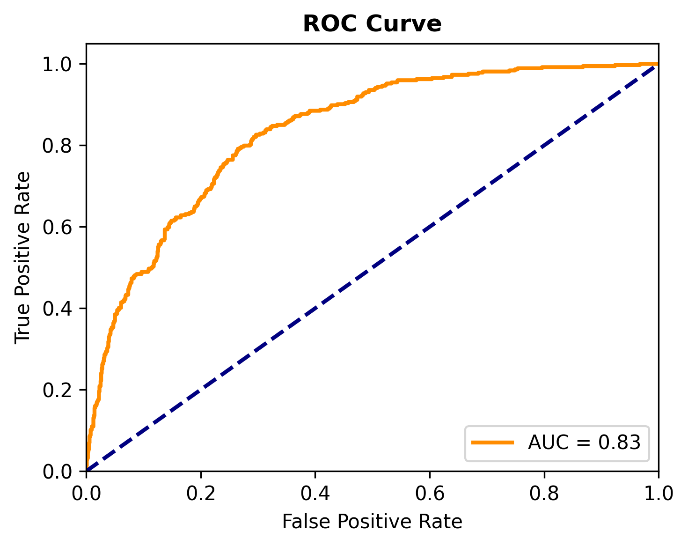
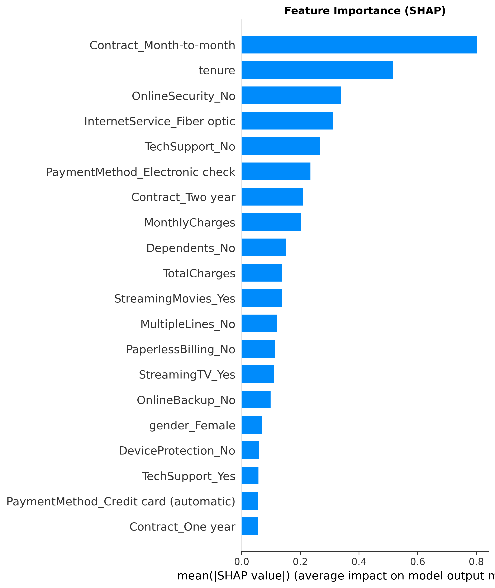
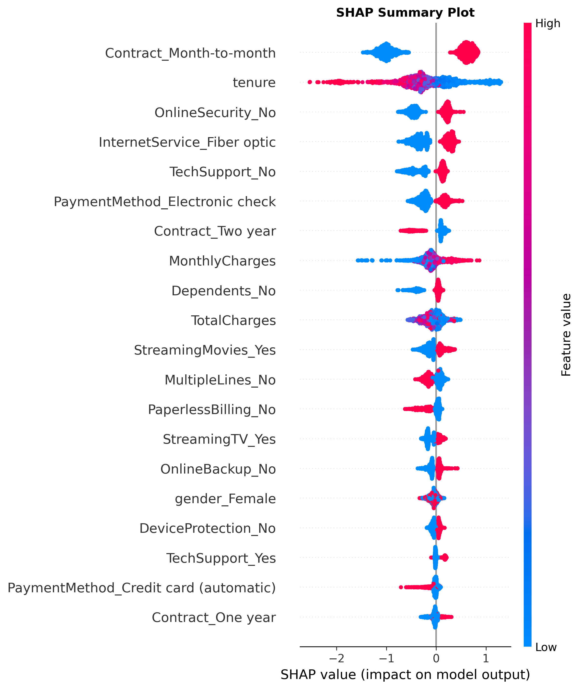
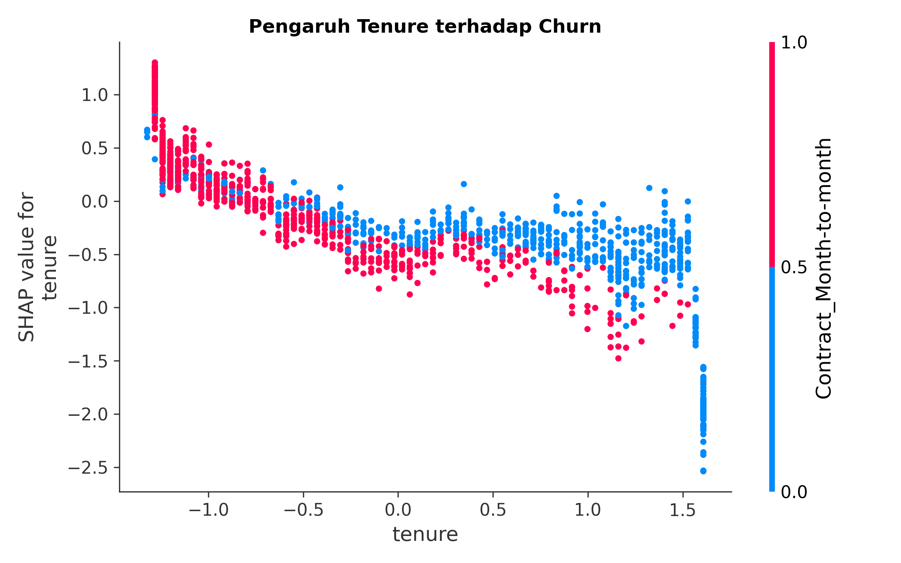

<div align="center">

#    End-to-End Customer Churn Prediction
###  Using LightGBM, SMOTE, and SHAP Explainability

<p align="center">
  
  
  
  
  
</p>

</div>

---

##  Project Overview
This project focuses on predicting customer churn in the telecommunications industry. Retaining existing customers is often more cost-effective than acquiring new ones. By accurately identifying customers at high risk of churning, businesses can proactively offer targeted incentives and improve customer retention strategies.

This end-to-end Machine Learning pipeline utilizes **LightGBM** (Light Gradient Boosting Machine) for its high performance and execution speed. To tackle the common issue of class imbalance in churn datasets, **SMOTE** (Synthetic Minority Over-sampling Technique) is applied. Finally, **SHAP** (SHapley Additive exPlanations) values are used to demystify the "black box" model and provide actionable insights into the key drivers of churn.

##  Key Features & Methodology
1. **Comprehensive Exploratory Data Analysis (EDA):** Deep dive into customer demographics, account information, and service usage to uncover churn patterns.
2. **Data Preprocessing:** Handling missing values, encoding categorical variables, and scaling numerical features.
3. **Addressing Class Imbalance:** Utilizing SMOTE to oversample the minority class (churned customers) to ensure a robust and unbiased model.
4. **Predictive Modeling:** Training and evaluating a high-performance **LightGBM Classifier**.
5. **Model Evaluation:** Assessing the model using robust metrics like Precision, Recall, F1-Score, Confusion Matrix, and ROC-AUC.
6. **Model Explainability (XAI):** Implementing SHAP to interpret feature importance globally and explain individual customer predictions locally.

##  Technology Stack
- **Language:** Python
- **Libraries:** Pandas, NumPy, Scikit-learn, Imbalanced-learn (SMOTE), LightGBM, SHAP
- **Visualization:** Matplotlib, Seaborn
- **Environment:** Jupyter Notebook

##  Dataset
The model is trained on the classic **Telco Customer Churn dataset** (`WA_Fn-UseC_-Telco-Customer-Churn.csv`).
It includes customer information such as:
- **Demographics:** Gender, Age range, Partners, Dependents
- **Services:** Phone, Multiple lines, Internet, Online security, Tech support, Streaming TV/Movies
- **Account details:** Tenure, Contract type, Paperless billing, Payment method, Monthly charges, Total charges
- **Target Variable:** `Churn` (Yes/No)

##  Visual Insights & Results

Below are some of the key visual findings from the analysis:

<details>
<summary><b>1. Exploratory Data Analysis (EDA)</b></summary>
<br>

| Churn Distribution | Tenure vs. Churn | Contract Type vs. Churn |
|:---:|:---:|:---:|
|  |  |  |

- **Insight:** The dataset is imbalanced (more non-churners than churners). Customers with shorter tenure and month-to-month contracts have a significantly higher churn rate.

</details>

<details>
<summary><b>2. Feature Correlation</b></summary>
<br>
<p align="center">
  
</p>

- **Insight:** Tenure, Contract Type, and Monthly Charges are highly correlated with the target variable.
</details>

<details>
<summary><b>3. Model Evaluation</b></summary>
<br>

| Confusion Matrix | ROC Curve |
|:---:|:---:|
|  |  |

</details>

<details>
<summary><b>4. Model Explainability (SHAP)</b></summary>
<br>

| Feature Importance (Bar) | SHAP Summary Plot | SHAP Dependence (Tenure) |
|:---:|:---:|:---:|
|  |  |  |

- **Insight:** The SHAP summary distinctly demonstrates that **Contract type (Month-to-month)**, **Tenure**, and **Monthly Charges** are the most powerful predictors behind customer churn decisions. High monthly charges mixed with low tenure dramatically push the model towards predicting "Churn".
</details>


##  How to Run Locally

1. **Clone the repository**
   ```bash
   git clone <your-github-repo-url>
   cd <repository-folder>
   ```

2. **Install the required dependencies**
   Make sure you have Python installed. Then run:
   ```bash
   pip install pandas numpy scikit-learn imbalanced-learn lightgbm shap matplotlib seaborn jupyter
   ```

3. **Run the Jupyter Notebook**
   ```bash
   jupyter notebook Customer-Churn-LightGBM-SMOTE.ipynb
   ```
   Execute the cells sequentially to run the entire pipeline from data loading to SHAP explanation.

##  Contributing
Contributions, issues, and feature requests are welcome! Feel free to check the issues page if you want to contribute.

##  License
This project is open-source and available under the [MIT License](LICENSE).
